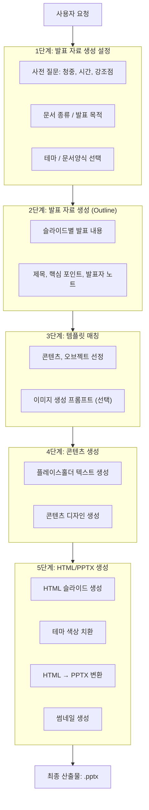

# PRD: PPT Skills Suite

**버전**: 1.0 (새 시작)
**작성일**: 2026-01-10
**상태**: Draft

## 목차

**기본**
- [1. 개요](#1-개요)
- [2. 아키텍처](#2-아키텍처)

**Part A: 시스템 컴포넌트**
- [3. 스킬 정의](#3-스킬-정의)
  - [3.1 ppt-extract 스킬](#31-ppt-extract-스킬-추출)
  - [3.2 ppt-gen 스킬](#32-ppt-gen-스킬-생성)
    - [5단계 파이프라인](#5단계-파이프라인)
    - [디자인 평가 루프](#디자인-평가-루프)
    - [디자인 가이드라인](#디자인-가이드라인)
- [4. ppt-manager (Electron 앱)](#4-ppt-manager-electron-앱)

**Part B: 데이터 아키텍처**
- [5. 저장소 구조](#5-저장소-구조)
- [6. 데이터 스키마](#6-데이터-스키마)
- [7. 템플릿 현황](#7-템플릿-현황)
- [8. 문서 종류](#8-문서-종류)
- [9. 사용 시나리오](#9-사용-시나리오)
- [10. 구현 현황 및 로드맵](#10-구현-현황-및-로드맵)
- [부록](#부록)

---

## 1. 개요

### 1.1 제품 비전

Claude Code 환경에서 **전문 디자이너 수준의 PPT**를 자동 생성하고 관리하는 통합 서비스.
**2개 스킬 + 1 앱** 구조: `ppt-extract`(추출) + `ppt-gen`(생성) + `ppt-manager`(관리).

### 1.2 핵심 결정사항

| 항목 | 결정 |
|------|------|
| 아키텍처 | **2개 스킬 + 1 앱**: ppt-extract (추출) + ppt-gen (생성) + ppt-manager (관리) |
| 기능 분류 | **추출 스킬** (파이프라인 외부) + **생성 스킬** (5단계 파이프라인) |
| 관리 기능 | **CLI 기반** (미래: Electron 데스크톱 앱) |
| 템플릿 시스템 | 테마, 콘텐츠, 오브젝트, 문서, 에셋 |

### 1.3 타겟 사용자

- **Primary**: 기업/비즈니스 사용자 (제안서, 보고서, 사업계획서)
- **Secondary**: 컨설턴트, 스타트업, 프로젝트 매니저
- **Tertiary**: 디자이너 (템플릿 추출/관리)

---

## 2. 아키텍처

### 2.1 구조 개요


<details>
<summary>📄 텍스트 버전 (ASCII Art)</summary>

```
┌─────────────────────────────────────────────────────────────────────────┐
│                    PPT Skills Suite (2개 스킬 + 1 앱)                    │
├─────────────────────────────────────────────────────────────────────────┤
│                                                                         │
│  ┌─────────────────────────────────────────────────────────────────┐   │
│  │ ppt-extract (추출 스킬) - 파이프라인 외부                          │   │
│  │ ━━━━━━━━━━━━━━━━━━━━━━━━━━━━━━━━━━━━                               │   │
│  │ • document-extract : 문서 양식 추출 (슬라이드 마스터, 로고)         │   │
│  │ • style-extract    : 테마 추출                                    │   │
│  │ • content-extract  : 콘텐츠 디자인 추출 (PPTX, 이미지)             │   │
│  │ • object-extract   : 복잡한 오브젝트 추출                          │   │
│  └─────────────────────────────────────────────────────────────────┘   │
│                              │                                          │
│                              │ 템플릿/에셋 등록                         │
│                              ▼                                          │
│  ┌─────────────────────────────────────────────────────────────────┐   │
│  │ ppt-gen (생성 스킬) - 5단계 파이프라인                             │   │
│  │ ━━━━━━━━━━━━━━━━━━━━━━━━━━━━━━━━━━━━                              │   │
│  │ • html2pptx : 새 PPT 생성 (5단계 파이프라인 실행)                  │   │
│  │ • template  : 템플릿 기반 생성                                    │   │
│  │ • ooxml     : 기존 PPT 수정                                       │   │
│  │ • analysis  : PPT 분석                                           │   │
│  └─────────────────────────────────────────────────────────────────┘   │
│                                                                         │
│  ┌─────────────────────────────────────────────────────────────────┐   │
│  │ ppt-manager (Electron 앱) - 관리 기능                             │   │
│  │ ━━━━━━━━━━━━━━━━━━━━━━━━━━━━━━━━━━                               │   │
│  │ • 템플릿 관리 (목록/아카이브/삭제)                                  │   │
│  │ • 에셋 관리 (추가/검색/삭제)                                       │   │
│  │ • 디자인 레퍼런스 검색                                             │   │
│  │ • 썸네일 생성/미리보기                                             │   │
│  └─────────────────────────────────────────────────────────────────┘   │
│                                                                         │
└─────────────────────────────────────────────────────────────────────────┘
```

</details>

### 2.2 공유 리소스

| 리소스 | 위치 | 설명 |
|--------|------|------|
| 테마 | `templates/themes/` | 색상/폰트 정의 |
| 콘텐츠 템플릿 | `templates/contents/` | 슬라이드 레이아웃 패턴 |
| 오브젝트 | `templates/objects/` | 재사용 가능한 도형 |
| 문서 템플릿 | `templates/documents/` | 회사별 양식 |
| 에셋 | `templates/assets/` | 아이콘, 이미지 |
| **썸네일** | `templates/thumbnails/` | 모든 타입의 미리보기 이미지 |
| 작업 폴더 | `working/` | 일반 작업용 임시 폴더 |
| 출력 폴더 | `output/` | 출력 문서 작업용 폴더 |

---

# Part A: 시스템 컴포넌트

## 3. 스킬 정의

### 3.1 ppt-extract 스킬 (추출)

템플릿과 에셋을 준비하는 스킬입니다. PPT 생성 파이프라인과 독립적으로 실행됩니다.

#### 추출 대상

**1. 문서 양식 (document-extract)**

| 항목 | 설명 |
|------|------|
| **추출 내용** | 표지, 목차, 내지, 이미지(로고 포함)이 포함된 슬라이드 마스터의 OOXML 형식 + 문서 전용 테마 |
| **추출 목적** | • 새로운 문서 생성 시 선택한 문서양식의 표지, 목차 기본 사용<br>• 문서양식의 내지(타이틀, 액션타이틀 기준 선택)의 콘텐츠 영역에 디자인 된 내용 추가하여 전체 문서 생성 |

**2. 테마 (style-extract)**

| 항목 | 설명 |
|------|------|
| **추출 내용** | 색상 팔레트, 폰트 정의 |
| **추출 목적** | 이미지/PPT에서 디자인 스타일 추출하여 테마로 저장 |

**3. 콘텐츠 (content-extract)**

| 항목 | 설명 |
|------|------|
| **추출 내용** | 추출한 문서에서 콘텐츠 영역의 디자인 |
| **추출 목적** | 데이터베이스로 저장하여 신규 슬라이드 생성 시 디자인의 재료로 사용 |

**4. 오브젝트 (object-extract)**

| 항목 | 설명 |
|------|------|
| **추출 내용** | 추출한 문서에서 복잡한 영역만 따로 오브젝트로 추출 |
| **추출 목적** | 재사용 가능한 도형/다이어그램 라이브러리 구축 |

#### 패턴 통합 (Pattern Consolidation)

> 유사한 슬라이드를 **하나의 유연한 템플릿**으로 통합하여 템플릿 수를 최소화합니다.

**통합 워크플로우:**
```
원본 PPT 슬라이드들
    │
    ▼ 패턴 시그니처 추출 (LLM)
    │
    ├── 슬라이드 3: 아이콘 카드 3개
    ├── 슬라이드 7: 아이콘 카드 4개  
    ├── 슬라이드 12: 아이콘 카드 2개
    │
    ▼ 유사도 80% 이상 → 같은 패턴
    │
    └── 통합 결과:
        grid-icon-cards (2~6개 지원)
```

**패턴 시그니처 비교 기준:**

| 구분 | 동일해야 함 | 달라도 됨 |
|------|------------|----------|
| **레이아웃** | 구조 유형 (grid, list, etc.) | 개수 (2~6) |
| **카드 구조** | 요소 구성 (icon+title+desc) | - |
| **스타일** | border-radius, shadow 유무 | 간격 (gap) |

> 가변 템플릿의 `variants` 스키마는 **저장 내용 → 3. 콘텐츠 → template.yaml 상세 스키마** 참조

#### 워크플로우 요약

| 워크플로우 | 트리거 | 입력 | 출력 |
|-----------|--------|------|------|
| `document-extract` | "이 PPT를 양식으로 등록해줘" | PPTX | 문서 템플릿 YAML, OOXML, 에셋 |
| `style-extract` | "이 이미지 스타일로" | 이미지 | 테마 YAML |
| `content-extract` | "이 슬라이드 저장해줘" | PPTX, 이미지 | 콘텐츠 YAML |
| `object-extract` | "이 도형 저장해줘" | PPTX | 오브젝트 YAML |

#### 저장 내용

**1. 문서 양식 (documents/)**

> 콘텐츠 없이 **레이아웃 구조만 추출**합니다. 원본 OOXML을 보존하여 100% 동일하게 재현합니다.

**추출 대상 레이아웃**

| 유형 | 개수 | 설명 |
|------|------|------|
| **표지** | 1~2장 | 기본 표지, 사진 표지 등 |
| **목차** | 1장 | 목차 레이아웃 |
| **섹션** | 1장 | 섹션 구분 슬라이드 |
| **내지** | 3~5장 | 형태별 대표만 선별 |

**내지 유형 분류 (LLM 판단)**

```
원본 PPT 슬라이드 레이아웃 분석
    │
    ▼ LLM 분류
    │
    ├── 표지/목차/섹션 ──────────► 각 1개 추출
    │
    └── 내지 유형별 그룹화
        ├── 유형 A: 제목만 ─────────► 대표 1개 추출
        ├── 유형 B: 제목+액션타이틀 ──► 대표 1개 추출
        ├── 유형 C: 2단 레이아웃 ────► 대표 1개 추출
        └── 유형 D: 이미지+텍스트 ───► 대표 1개 추출

결과: 양식당 총 6~8장 레이아웃
```

**LLM 분류 기준**

| 기준 | 설명 |
|------|------|
| 플레이스홀더 개수 | 1개(제목만) vs 2개(제목+액션) vs 3개+ |
| 플레이스홀더 배치 | 상단/중앙/좌우 분할 |
| content_zone 크기 | 전체 vs 반쪽 vs 작은 영역 |
| 배경 요소 | 색상 배경 vs 이미지 배경 |

**저장 파일**

| 저장 항목 | 파일/위치 | 설명 |
|----------|----------|------|
| **슬라이드 마스터** | `ooxml/slideMaster1.xml` | 공통 요소 (로고, 푸터, 슬라이드 번호) |
| **슬라이드 레이아웃** | `ooxml/slideLayout*.xml` | 선별된 레이아웃만 저장 |
| **테마** | `ooxml/theme1.xml` | 색상 스킴, 폰트 스킴, 효과 |
| **관계 파일** | `ooxml/_rels/*.xml.rels` | rId → 파일 경로 매핑 |
| **미디어 파일** | `assets/media/` | 로고, 배경 이미지 |
| **썸네일** | `thumbnails/` | 각 레이아웃 미리보기 이미지 |

**레이아웃 메타데이터 (YAML)** → [6.1 문서 양식 스키마](#61-문서-양식-스키마-documentsyaml) 참조

**문서 생성 시 활용**

```
1. 문서양식 선택 → "동국그룹/기본양식"
2. OOXML 로드 (slideMaster + 필요한 slideLayout)
3. 슬라이드 생성:
   ├── 표지: layout[0] + 제목/부제목 텍스트 치환
   ├── 목차: layout[1] + 목차 항목 치환
   ├── 섹션: layout[2] + 섹션 제목 치환
   └── 내지: layout[3~N] + content_zone에 콘텐츠 디자인 삽입
4. 결과: 원본과 동일한 헤더/푸터/로고의 PPTX
```

**2. 테마 (themes/)**

| 저장 항목 | 설명 |
|----------|------|
| 색상 팔레트 | primary, secondary, accent, background, surface, text 등 |
| 폰트 정의 | 제목 폰트, 본문 폰트, 한글 폰트 |
| 스타일 힌트 | 둥근 모서리, 그림자 등 |
| **썸네일** | 색상 팔레트 시각화 이미지 |

**3. 콘텐츠 (contents/) - 하이브리드 방식**
> **HTML+CSS 통합 템플릿 + 메타데이터 통합**

| 저장 항목 | 파일 | 설명 |
|----------|------|------|
| **템플릿** | `template.html` | HTML 구조 + CSS 스타일 (Handlebars 문법) |
| **메타데이터** | `template.yaml` | 슬롯 정보 + 시맨틱 설명 + 가변 옵션 |
| **썸네일** | `thumbnail.png` | 시각적 참조 및 검색용 |

**template.yaml 스키마** → [6.3 콘텐츠 템플릿 스키마](#63-콘텐츠-템플릿-스키마-contentstemplateyaml) 참조

**4. 오브젝트 (objects/) - 멀티 포맷**
> **이미지(복잡) + SVG(단순)** 유연한 지원

| 저장 항목 | 파일/위치 | 설명 |
|----------|----------|------|
| **이미지** | `object.png` | 복잡한 다이어그램(순환도 등) 원본 이미지 |
| **벡터** | `object.svg` | 편집 가능한 단순 도해 (선택적) |
| **메타데이터** | `metadata.yaml` | 텍스트 위치, 오버레이 정보 |
| **썸네일** | `thumbnail.png` | 미리보기 이미지 |

#### 저장 구조

> 전체 폴더 구조는 **2.3 저장소 구조** 참조

### 3.2 ppt-gen 스킬 (생성)

새로운 PPT를 생성하거나 기존 PPT를 수정하는 워크플로우입니다.

| 워크플로우 | 트리거 | 설명 |
|-----------|--------|------|
| `html2pptx` | "PPT 만들어줘" | 5단계 파이프라인 실행 |
| `template` | "동국제강 양식으로" | 템플릿 기반 생성 |
| `ooxml` | "이 PPT 수정해줘" | OOXML 직접 편집 |
| `analysis` | "PPT 분석해줘" | PPT 구조/내용 분석 |

#### 하이브리드 템플릿 활용 (방식 2+4)

> 추출된 템플릿을 **정확한 재현(방식 4)** 또는 **유연한 생성(방식 2)**으로 활용합니다.

**생성 워크플로우:**
```
1. 콘텐츠 요구사항 분석
     │
     ▼
2. 템플릿 매칭 (registry.yaml 검색)
     │
     ├── 매칭 성공 → 방식 4: HTML 템플릿 사용
     │   ├── template.html 로드
     │   ├── 테마 CSS 변수 주입
     │   └── 데이터 바인딩 (Handlebars)
     │
     └── 매칭 실패 → 방식 2: 시맨틱 기반 생성
         ├── 유사 템플릿의 semantic_description 참조
         └── LLM이 새 HTML 생성
     │
     ▼
3. 테마 변수 주입
     :root {
       --primary: {theme.colors.primary};
       --font-heading: {theme.fonts.major};
     }
     │
     ▼
4. Playwright 렌더링 → 이미지
     │
     ▼
5. 이미지 → PPTX 변환
```

**가변 템플릿 처리:**
```yaml
# 요청: "핵심 서비스 4가지를 카드로 보여줘"
템플릿: grid-icon-cards (element_count: "2-6")
매칭된 variant: count: 4, layout: { columns: 4, gap: 3% }

# HTML 렌더링 시 4개 카드로 자동 조정
```

> 템플릿 파일 구조 상세는 **3.1 ppt-extract → 저장 내용 → 3. 콘텐츠** 참조

#### 5단계 파이프라인



#### 디자인 평가 루프

Stage 4에서 HTML 슬라이드 생성 후 LLM이 디자인 품질을 평가하고 불합격 시 재매칭/재디자인합니다.

**평가 기준 (100점 만점)**:

| 카테고리 | 배점 | 평가 항목 |
|---------|-----|----------|
| 레이아웃 | 25점 | 정렬 일관성, 여백 균형, 시각적 균형 |
| 타이포그래피 | 20점 | 가독성, 계층 구조, 줄간격/자간 |
| 색상 | 20점 | 대비, 조화, 강조 적절성 |
| 콘텐츠 적합성 | 25점 | 템플릿 매칭, 정보량 |
| 시각 요소 | 10점 | 아이콘/이미지, 장식 요소 |

**합격 기준**: 85점 이상 또는 3회 시도 후 최고 점수 선택

#### 디자인 가이드라인

디자인 평가 루프에서 적용되는 세부 체크리스트입니다.

**1. 레이아웃 & 그리드 시스템**
- 콘텐츠 영역 크기 조정 (문서양식의 content_zone에 맞게)
- 그리드 정합성 (12분할 또는 16분할 기준)
- 3분할 구도 (Rule of Thirds): 핵심 요소를 교차점에 배치
- 시선 흐름 (Z-패턴, F-패턴): 왼쪽→오른쪽, 위→아래
- 하나의 슬라이드, 하나의 핵심 메시지

**2. 여백 (Whitespace)**
- 슬라이드 외곽 여백: 5~10% (최소 1.5cm)
- 요소 간 간격: 8의 배수 (8, 16, 24, 32, 40px)
- 콘텐츠 밀도 제한: 본문 5줄 이하, 시각요소 3개 이하
- 그룹핑: 관련 정보는 가깝게, 비관련 정보는 여백으로 분리

**3. 타이포그래피**

| 요소 | 크기 | 굵기 |
|------|------|------|
| 제목 | 36~44pt | Bold/Extra Bold |
| 부제목/액션타이틀 | 24~28pt | Semi-Bold |
| 본문 | 18~24pt | Regular |
| 캡션/주석 | 12~14pt | - |

- 시각적 위계: 제목과 본문 크기 차이 1.5배 이상
- 폰트 조합: 최대 2~3종
- 추천 폰트: Pretendard, Noto Sans KR, SUIT, 나눔스퀘어Neo
- 줄간격: 본문 1.4~1.6배
- 한 줄 가독성: 40~60자 이내 (5x5 규칙)

**4. 색상 & 대비**
- WCAG AA 기준: 텍스트/배경 대비 4.5:1 이상
- 본문 색상: 순흑(#000) 대신 다크그레이(#333333) 권장
- 강조색 일관성: 포인트 컬러 1~2가지로 제한

**5. 시각적 깊이 & 효과**
- 그림자: 미묘하게 (box-shadow: 0 4px 12px rgba(0,0,0,0.08~0.12))
- 모서리 둥글기: 일관된 border-radius (8px 또는 16px)
- 아이콘 스타일 통일: Outline vs Filled 중 하나

**6. 균형 & 비례**
- 시각적 무게 균형: 큰 이미지 ↔ 텍스트 블록 대칭
- 요소 크기 비율: 조화로운 비율 (1:1.5:2, 황금비 1:1.618)
- 정렬 기준선: 모든 요소가 보이지 않는 기준선에 정렬

---

## 4. ppt-manager (Electron 앱)

### 4.1 기능 요구사항

| 기능 | 설명 | 우선순위 |
|------|------|----------|
| 템플릿 목록 | 썸네일 그리드 뷰 | P0 |
| 템플릿 상세 | 미리보기 + 메타데이터 | P0 |
| 템플릿 삭제/아카이브 | CRUD 작업 | P0 |
| 에셋 추가 | 드래그&드롭 업로드 | P1 |
| 에셋 검색 | 태그/키워드 필터링 | P1 |
| 태그 관리 | 태그 추가/수정/삭제 | P2 |
| 테마 미리보기 | 색상 팔레트 시각화 | P2 |

### 4.2 UI/UX 설계

```
┌─────────────────────────────────────────────────────────────────┐
│  ppt-manager                                          [─][□][×] │
├─────────────────────────────────────────────────────────────────┤
│ ┌───────────┐ ┌─────────────────────────────────────────────┐   │
│ │ 사이드바   │ │                 메인 영역                    │   │
│ │           │ │                                             │   │
│ │ ▼ 템플릿   │ │  ┌─────┐ ┌─────┐ ┌─────┐ ┌─────┐ ┌─────┐  │   │
│ │   콘텐츠   │ │  │     │ │     │ │     │ │     │ │     │  │   │
│ │   문서     │ │  │cover│ │ toc │ │comp │ │proc │ │stat │  │   │
│ │   테마     │ │  │     │ │     │ │     │ │     │ │     │  │   │
│ │           │ │  └─────┘ └─────┘ └─────┘ └─────┘ └─────┘  │   │
│ │ ▼ 에셋    │ │                                             │   │
│ │   아이콘   │ │  ┌─────┐ ┌─────┐ ┌─────┐ ┌─────┐ ┌─────┐  │   │
│ │   이미지   │ │  │     │ │     │ │     │ │     │ │     │  │   │
│ │           │ │  │grid │ │time │ │quote│ │close│ │cycle│  │   │
│ │           │ │  │     │ │     │ │     │ │     │ │     │  │   │
│ └───────────┘ │  └─────┘ └─────┘ └─────┘ └─────┘ └─────┘  │   │
│               └─────────────────────────────────────────────┘   │
├─────────────────────────────────────────────────────────────────┤
│ 검색: [________________] 카테고리: [전체 ▼] 테마: [전체 ▼]       │
└─────────────────────────────────────────────────────────────────┘
```

---

# Part B: 데이터 아키텍처

## 5. 저장소 구조

> **ppt-extract, ppt-gen, ppt-manager** 모두 동일한 저장소 구조를 사용합니다.

### 5.1 폴더 구조

```
templates/
├── documents/                      # 문서 양식
│   ├── registry.yaml               # 인덱스
│   └── {group}/{template}/
│       ├── template.yaml           # 메타데이터
│       ├── ooxml/                  # 슬라이드 마스터
│       └── assets/                 # 로고, 이미지
│
├── themes/                         # 테마
│   ├── registry.yaml
│   └── {theme_id}/
│       └── theme.yaml
│
├── contents/                       # 콘텐츠 템플릿
│   ├── registry.yaml
│   └── {category}/{template_id}/
│       ├── template.html           # HTML + CSS (Handlebars)
│       └── template.yaml           # 슬롯 + 시맨틱
│
├── objects/                        # 오브젝트
│   ├── registry.yaml
│   └── {category}/{object_id}/
│       ├── object.png
│       ├── object.svg              # (옵션)
│       └── metadata.yaml
│
├── assets/                         # 공유 에셋
│   ├── icons/
│   └── images/
│
└── thumbnails/                     # 썸네일 (미러 구조)
    ├── documents/{group}/{template}.png
    ├── themes/{theme_id}.png
    ├── contents/{category}/{template_id}.png
    └── objects/{category}/{object_id}.png
```

### 5.2 썸네일 미러링

- 원본 경로: `templates/{type}/.../{id}/`
- 썸네일 경로: `templates/thumbnails/{type}/.../{id}.png`
- 예: `contents/grid/grid-icon-cards/` → `thumbnails/contents/grid/grid-icon-cards.png`

---

## 6. 데이터 스키마

> ppt-extract, ppt-gen, ppt-manager 모두 동일한 스키마를 사용합니다.

### 6.1 문서 양식 스키마 (documents/*.yaml)

```yaml
document:
  id: "dongkuk-standard"
  name: "동국그룹 기본양식"
  group: "동국그룹"
  source_file: "원본.pptx"
  extracted_at: "2026-01-10"

layouts:
  - index: 0
    name: "표지"
    type: cover
    ooxml_file: "ooxml/slideLayout1.xml"
    thumbnail: "thumbnails/layout-0.png"
    placeholders:
      - id: "title"
        type: ctrTitle
        position: { x: 5%, y: 35%, width: 90%, height: 15% }
      - id: "subtitle"
        type: subTitle
        position: { x: 5%, y: 52%, width: 90%, height: 8% }

  - index: 3
    name: "내지 (제목+액션타이틀)"
    type: body
    variant: "title-action"
    ooxml_file: "ooxml/slideLayout4.xml"
    content_zone:
      position: { x: 3%, y: 24%, width: 94%, height: 72% }

master:
  ooxml_file: "ooxml/slideMaster1.xml"
  common_elements:
    - id: "logo"
      file: "assets/media/logo.png"
      position: { x: 90%, y: 2%, width: 8%, height: 6% }

theme:
  ooxml_file: "ooxml/theme1.xml"
  colors:
    dk2: "#002452"
    accent1: "#C51F2A"
  fonts:
    major: "맑은 고딕"
    minor: "맑은 고딕"
```

### 6.2 테마 스키마 (themes/*.yaml)

```yaml
id: deepgreen
name: "딥그린 테마"
colors:
  primary: "#1a5f4a"
  secondary: "#2d7a5e"
  accent: "#4a9d7f"
  background: "#f5f9f7"
  surface: "#ffffff"
  text: "#1a1a1a"
  muted: "#6b7c74"
fonts:
  major: "Pretendard"
  minor: "Pretendard"
style_hints:
  border_radius: "16px"
  shadow: "0 4px 12px rgba(0,0,0,0.08)"
```

### 6.3 콘텐츠 템플릿 스키마 (contents/*/template.yaml)

```yaml
# === 기본 정보 ===
id: grid-icon-cards
category: grid
element_count: "2-6"
description: "아이콘 카드 그리드 (2~6개)"

# === 가변 레이아웃 ===
variants:
  - count: 2
    layout: { columns: 2, gap: 8% }
  - count: 3
    layout: { columns: 3, gap: 4% }
  - count: 4
    layout: { columns: 4, gap: 3% }

# === 슬롯 정의 (Handlebars 바인딩용) ===
slots:
  - name: title
    type: text
    required: true
    example: "핵심 서비스"
  - name: items
    type: array
    min: 2
    max: 6
    item_schema:
      - { name: icon, type: image }
      - { name: title, type: text, max_length: 20 }
      - { name: description, type: text, max_length: 80 }

# === 시맨틱 설명 (LLM 재현용) ===
semantic_description: |
  슬라이드 상단에 왼쪽 정렬된 큰 제목(48px, bold)이 있습니다.
  그 아래 2~6개의 동일한 크기의 카드가 가로로 균등 배치됩니다.
  각 카드는 둥근 모서리(16px)와 그림자가 있는 흰색 배경입니다.

# === 검색 키워드 ===
match_keywords: [그리드, 카드, 아이콘, 서비스]
```

> **Handlebars**: 데이터 바인딩에 [Handlebars.js](https://handlebarsjs.com/) 사용. `{{title}}`, `{{#each items}}` 등.

### 6.4 오브젝트 스키마 (objects/*/metadata.yaml)

```yaml
id: cycle-6segment
category: diagram
name: "6단계 순환도"
description: "6개 단계가 순환하는 원형 다이어그램"
text_overlays:
  - id: "center"
    position: { x: 50%, y: 50% }
    text: "핵심 가치"
  - id: "segment1"
    position: { x: 50%, y: 15% }
    text: "1단계"
keywords: [순환, 사이클, 프로세스, 6단계]
```

---

## 7. 템플릿 현황

### 7.1 테마 (themes/)

색상과 폰트를 정의하는 테마 파일입니다.

**파일 목록**:
- `default.yaml` - 기본 블루 테마
- `deepgreen.yaml` - 자연/친환경 테마
- `brandnew.yaml` - 신선한 스카이블루 테마
- `동국.yaml` - 동국그룹 브랜드 테마

### 7.2 콘텐츠 템플릿 (contents/)

슬라이드 레이아웃 패턴을 정의합니다.

**카테고리별 템플릿 수** (40개+):

| 카테고리 | 개수 | 예시 |
|----------|------|------|
| cover | 3 | cover-centered1, cover-photo1, cover-simple1 |
| toc | 3 | toc-3col1, toc-list-image1, toc-simple1 |
| section | 2 | section-number1, section-textured1 |
| comparison | 4 | comparison-2col1, pros-cons1 |
| process | 5 | process-flow1, process-honeycomb1 |
| chart | 2 | chart-bar-table1 |
| stats | 2 | stats-dotgrid1, stat-cards1 |
| grid | 3 | grid-4col-icon1, grid-3col-image1 |
| diagram | 6 | matrix-2x21, cycle-circular1, venn-4segment1 |
| timeline | 1 | timeline1 |
| content | 1 | image-text1 |
| quote | 1 | quote-centered1 |
| closing | 1 | closing-thankyou1 |

### 7.3 문서 템플릿 (documents/)

회사별 양식을 정의합니다.

**지원 그룹**:
- 동국그룹 (동국제강, 동국CM 등)

### 7.4 에셋 (assets/)

- 아이콘 매핑 (키워드 → 아이콘)
- AI 이미지 프롬프트 템플릿

---

## 8. 문서 종류

> **문서 양식(시각적 형태)**과 구분되는 개념으로, 실제 문서의 **내용/목적**을 정의합니다.

| 문서 종류 | 설명 | 예상 슬라이드 구성 |
|----------|------|------------------|
| **제안서** (Proposal) | 고객 설득을 위한 임팩트 중심 문서 | 표지, 배경/니즈, 제안 내용, 기대효과, 회사소개 |
| **사업계획서** (Biz Plan) | 체계적인 전략 수립을 위한 상세 문서 | 표지, 시장분석, 비즈니스모델, 실행계획, 재무계획 |
| **프로젝트 보고서** (Report) | 진행 현황 및 성과 공유를 위한 보고 문서 | 표지, 요약, 상세 실적, 이슈/리스크, 향후 계획 |
| **교육 자료** (Lecture) | 정보 전달 및 학습을 위한 설명 중심 문서 | 표지, 학습목표, 개념 설명, 예시/실습, 요약 |

> **구분**: `문서 양식`은 "동국제강 스타일" 같은 **Look & Feel**을, `문서 종류`는 "제안서" 같은 **논리적 구조(Outline)**를 결정합니다.

## 9. 사용 시나리오

### 9.1 ppt-extract 사용

```
사용자: "이 슬라이드 저장해줘" [PPT 파일 첨부]

결과:
1. 슬라이드 분석 → 디자인 의도 파악
2. YAML 템플릿 생성
3. registry 업데이트
4. 썸네일 생성 및 저장
```

### 9.2 ppt-gen 사용

```
사용자: "스마트 물류 시스템 제안서 PPT 만들어줘"

결과:
1. 콘텐츠 분석 → 슬라이드 구조 설계
2. 사전 질문 (청중, 시간, 강조점)
3. registry 검색 → 템플릿 매칭
4. 테마 선택 + HTML 슬라이드 생성
5. PPTX 변환 + 썸네일 검증
```

### 9.3 ppt-manager 사용

```
1. 앱 실행 → 템플릿 그리드 표시
2. 카테고리 필터링
3. 템플릿 클릭 → 상세 정보 확인
4. "아카이브" 버튼 클릭 → 비활성화
5. 에셋 탭 → 새 아이콘 드래그&드롭
```

---

## 10. 구현 현황 및 로드맵

### 10.1 완료된 기능

| 영역 | 상태 | 설명 |
|------|------|------|
| html2pptx 파이프라인 | ✅ | HTML → PPTX 변환 |
| 템플릿 기반 생성 | ✅ | 문서 템플릿 사용 |
| OOXML 편집 | ✅ | 기존 PPT 수정 |
| 콘텐츠 템플릿 추출 | ✅ | 스키마 완성 |
| 문서 템플릿 추출 | ✅ | 회사별 양식 등록 |
| 스타일 추출 | ✅ | 이미지 색상 분석 |
| 디자인 검색 | ✅ | 웹 레퍼런스 검색 |
| 템플릿 관리 | ✅ | CLI 기반 CRUD |
| 에셋 관리 | ✅ | CLI 기반 CRUD |
| 썸네일 생성 | ✅ | 검증용 이미지 |
| 디자인 토큰 | ✅ | 테마 독립적 템플릿 |

### 10.2 미완료 기능

| 기능 | 상태 | 설명 |
|------|------|------|
| AI 이미지 생성 연동 | ❌ | DALL-E/Midjourney 연결 |
| ppt-manager Electron 앱 | ⬜ | GUI 관리 앱 신규 개발 |

---

## 부록

### A. 콘텐츠 템플릿 카테고리 (19개)

cover, toc, section, comparison, process, chart, stats, grid, diagram, timeline, content, quote, closing, cycle, matrix, feature, flow, table, infographic

### B. 아이콘 시스템

**카테고리별 분류**:
- technology: 보안, 속도, 데이터, AI, 클라우드, 서버 등 (10개)
- business: 성장, 목표, 전략, 성공, 효율 등 (8개)
- logistics: 창고, 배송, 주문, 재고, 대시보드 (5개)
- risk: 위험, 지연, 오류, 변경 (4개)
- 기타: communication, process, finance, quality, document, location, customer
