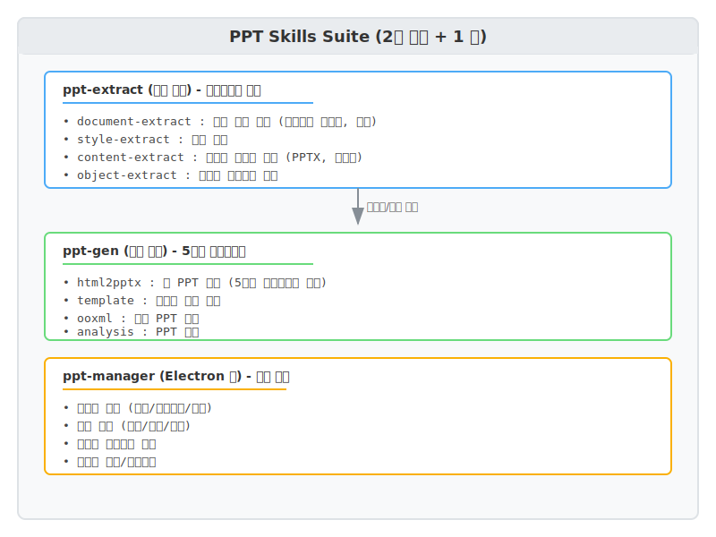
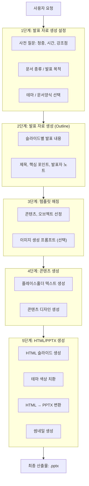

# PRD: PPT Skills Suite

**버전**: 1.0 (새 시작)
**작성일**: 2026-01-10
**상태**: Draft

## 목차

**기본**
- [1. 개요](#1-개요)
- [2. 아키텍처](#2-아키텍처)

**Part A: 시스템 컴포넌트**
- [3. 스킬 정의](#3-스킬-정의)
  - [3.1 ppt-extract 스킬](#31-ppt-extract-스킬-추출)
  - [3.2 ppt-gen 스킬](#32-ppt-gen-스킬-생성)
- [4. ppt-manager (Electron 앱)](#4-ppt-manager-electron-앱)

**Part B: 데이터 아키텍처**
- [5. 저장소 구조](#5-저장소-구조)
- [6. 데이터 스키마](#6-데이터-스키마)
- [7. 템플릿 현황](#7-템플릿-현황)
- [8. 문서 종류](#8-문서-종류)
- [9. 사용 시나리오](#9-사용-시나리오)
- [10. 구현 현황 및 로드맵](#10-구현-현황-및-로드맵)

**부록**
- [A. 콘텐츠 템플릿 카테고리](#a-콘텐츠-템플릿-카테고리-동적-확장)
- [B. 아이콘 시스템](#b-아이콘-시스템-동적-확장)
- [C. 영역 감지 코드](#c-영역-감지-코드)
- [상세 스키마/코드 → 부록 파일](./PRD_PPT_Skills_Suite_Appendix.md)

---

## 1. 개요

### 1.1 제품 비전

Claude Code 환경에서 **전문 디자이너 수준의 PPT**를 자동 생성하고 관리하는 통합 서비스.
**2개 스킬 + 1 앱** 구조: `ppt-extract`(추출) + `ppt-gen`(생성) + `ppt-manager`(관리).

### 1.2 핵심 결정사항

| 항목 | 결정 |
|------|------|
| 아키텍처 | **2개 스킬 + 1 앱**: ppt-extract (추출) + ppt-gen (생성) + ppt-manager (관리) |
| 기능 분류 | **추출 스킬** (파이프라인 외부) + **생성 스킬** (5단계 파이프라인) |
| 관리 기능 | **CLI 기반** (미래: Electron 데스크톱 앱) |
| 템플릿 시스템 | 테마, 콘텐츠, 오브젝트, 문서, 에셋 |

### 1.3 타겟 사용자

- **Primary**: 기업/비즈니스 사용자 (제안서, 보고서, 사업계획서)
- **Secondary**: 컨설턴트, 스타트업, 프로젝트 매니저
- **Tertiary**: 디자이너 (템플릿 추출/관리)

---

## 2. 아키텍처

### 2.1 구조 개요



<details>
<summary>📄 텍스트 버전 (ASCII Art)</summary>

```
┌─────────────────────────────────────────────────────────────────────────┐
│                    PPT Skills Suite (2개 스킬 + 1 앱)                    │
├─────────────────────────────────────────────────────────────────────────┤
│                                                                         │
│  ┌─────────────────────────────────────────────────────────────────┐   │
│  │ ppt-extract (추출 스킬) - 파이프라인 외부                          │   │
│  │ ━━━━━━━━━━━━━━━━━━━━━━━━━━━━━━━━━━━━                               │   │
│  │ • document-extract : 문서 양식 추출 (슬라이드 마스터, 로고)         │   │
│  │ • style-extract    : 테마 추출                                    │   │
│  │ • content-extract  : 콘텐츠 디자인 추출 (PPTX, 이미지)             │   │
│  │ • object-extract   : 복잡한 오브젝트 추출                          │   │
│  └─────────────────────────────────────────────────────────────────┘   │
│                              │                                          │
│                              │ 템플릿/에셋 등록                         │
│                              ▼                                          │
│  ┌─────────────────────────────────────────────────────────────────┐   │
│  │ ppt-gen (생성 스킬) - 5단계 파이프라인                             │   │
│  │ ━━━━━━━━━━━━━━━━━━━━━━━━━━━━━━━━━━━━                              │   │
│  │ • html2pptx : 새 PPT 생성 (5단계 파이프라인 실행)                  │   │
│  │ • template  : 템플릿 기반 생성                                    │   │
│  │ • ooxml     : 기존 PPT 수정                                       │   │
│  │ • analysis  : PPT 분석                                           │   │
│  └─────────────────────────────────────────────────────────────────┘   │
│                                                                         │
│  ┌─────────────────────────────────────────────────────────────────┐   │
│  │ ppt-manager (Electron 앱) - 관리 기능                             │   │
│  │ ━━━━━━━━━━━━━━━━━━━━━━━━━━━━━━━━━━                               │   │
│  │ • 템플릿 관리 (목록/아카이브/삭제)                                  │   │
│  │ • 에셋 관리 (추가/검색/삭제)                                       │   │
│  │ • 디자인 레퍼런스 검색                                             │   │
│  │ • 썸네일 생성/미리보기                                             │   │
│  └─────────────────────────────────────────────────────────────────┘   │
│                                                                         │
└─────────────────────────────────────────────────────────────────────────┘
```

</details>

### 2.2 공유 리소스

| 리소스 | 위치 | 설명 |
|--------|------|------|
| 테마 | `templates/themes/` | 색상/폰트 정의 |
| 콘텐츠 템플릿 | `templates/contents/` | 슬라이드 레이아웃 패턴 |
| 오브젝트 | `templates/objects/` | 재사용 가능한 도형 |
| 문서 템플릿 | `templates/documents/` | 회사별 양식 |
| 에셋 | `templates/assets/` | 아이콘, 이미지 |
| **썸네일** | `templates/thumbnails/` | 모든 타입의 미리보기 이미지 |
| 작업 폴더 | `working/` | 일반 작업용 임시 폴더 |
| 출력 폴더 | `output/` | 출력 문서 작업용 폴더 |

---

# Part A: 시스템 컴포넌트

## 3. 스킬 정의

### 3.1 ppt-extract 스킬 (추출)

템플릿과 에셋을 준비하는 스킬입니다. PPT 생성 파이프라인과 독립적으로 실행됩니다.

#### 추출 대상

**1. 문서 양식 (document-extract)**

| 항목 | 설명 |
|------|------|
| **추출 내용** | 표지, 목차, 내지, 이미지(로고 포함)이 포함된 슬라이드 마스터의 OOXML 형식 + 문서 전용 테마 |
| **추출 목적** | • 새로운 문서 생성 시 선택한 문서양식의 표지, 목차 기본 사용<br>• 문서양식의 내지(타이틀, 액션타이틀 기준 선택)의 콘텐츠 영역에 디자인 된 내용 추가하여 전체 문서 생성 |

**2. 테마 (style-extract)**

| 항목 | 설명 |
|------|------|
| **추출 내용** | 색상 팔레트, 폰트 정의 |
| **추출 목적** | 이미지/PPT에서 디자인 스타일 추출하여 테마로 저장 |

**3. 콘텐츠 (content-extract)**

| 항목 | 설명 |
|------|------|
| **추출 내용** | 추출한 문서에서 콘텐츠 영역의 디자인 |
| **추출 목적** | 데이터베이스로 저장하여 신규 슬라이드 생성 시 디자인의 재료로 사용 |

**오브젝트 자동 추출:**

> content-extract 중 **LLM이 복잡한 도형을 자동 감지**하여 오브젝트로 분리 저장합니다.

| 판단 기준 | 예시 | 저장 위치 |
|----------|------|----------|
| 복잡한 다이어그램 | 순환도, 벤다이어그램 | `objects/diagram/` |
| 다단계 프로세스 도형 | 허니콤, 플로우 | `objects/process/` |
| 데이터 시각화 | 차트, 그래프 | `objects/chart/` |

```
content-extract 실행
    │
    ▼ LLM 분석
    │
    ├── 일반 레이아웃 ──────────→ contents/{category}/ 저장
    │
    └── 복잡한 도형 감지 ────────→ objects/{category}/ 저장 (자동)
        (순환도, 다이어그램 등)
```

#### 패턴 통합 (Pattern Consolidation)

> 유사한 슬라이드를 **하나의 유연한 템플릿**으로 통합하여 템플릿 수를 최소화합니다.
> 
> ⚠️ **통합 범위**: 같은 문서 템플릿(출처) 내에서만 통합합니다. 서로 다른 문서 템플릿 간에는 패턴 시그니처가 유사해도 별도로 저장합니다.

**통합 워크플로우:**
```
동국시스템즈.pptx 추출:
    │
    ▼ 패턴 시그니처 추출 (LLM)
    │
    ├── 슬라이드 3: 아이콘 카드 3개 ─┬→ 동국시스템즈/grid-icon-cards (통합)
    ├── 슬라이드 7: 아이콘 카드 4개 ─┘   (2~6개 지원)
    └── 슬라이드 12: 타임라인 ──────→ 동국시스템즈/timeline (별도)

A회사.pptx 추출 (별도):
    └── 아이콘 카드 ─────────────→ A회사/grid-icon-cards (별도 저장!)
```

**패턴 시그니처 비교 기준:**

| 구분 | 동일해야 함 | 달라도 됨 |
|------|------------|----------|
| **출처** | 같은 문서 템플릿에서 추출 | - |
| **레이아웃** | 구조 유형 (grid, list, etc.) | 개수 (2~6) |
| **카드 구조** | 요소 구성 (icon+title+desc) | - |
| **스타일** | border-radius, shadow 유무 | 간격 (gap) |

> 가변 템플릿의 `variants` 스키마는 **저장 내용 → 3. 콘텐츠 → template.yaml 상세 스키마** 참조

#### 워크플로우 요약

| 워크플로우 | 트리거 | 입력 | 출력 |
|-----------|--------|------|------|
| `document-extract` | "이 PPT를 양식으로 등록해줘" | PPTX | 문서 템플릿 YAML, OOXML, 에셋 |
| `document-update` | "양식 업데이트해줘" | PPTX | 기존 문서 덮어쓰기 |
| `document-delete` | "양식 지워줘" | 문서 ID | 문서 + 연관 콘텐츠 삭제 |
| `style-extract` | "이 이미지 스타일로" | 이미지 | 테마 YAML |
| `content-extract` | "이 슬라이드 저장해줘" | PPTX | YAML + HTML + OOXML + 오브젝트(자동) |
| `content-extract` | "이 디자인 저장해줘" | 이미지 | YAML + HTML |
| **`content-create`** | "간트차트 템플릿 만들어줘" | **라이브러리/코드** | 직접 생성된 템플릿 |

#### 차트 라이브러리 콘텐츠 (content-create)

> 추출할 원본이 없는 **동적 차트/시각화 템플릿**을 직접 생성하여 등록합니다.

**지원 라이브러리:**

| 라이브러리 | 용도 | 크기 | PPT 적합성 |
|-----------|------|------|-----------|
| **Frappe Gantt** | 프로젝트 일정 | 40KB | ⭐⭐⭐ |
| **Mermaid** | 다이어그램, 간트 | 200KB | ⭐⭐⭐ |
| **Chart.js** | 막대/선/파이 차트 | 70KB | ⭐⭐ |
| **Plotly** | 고급 차트, 3D | 3MB | ⭐ |
| **D3.js** | 커스텀 SVG | 280KB | ⭐⭐ |

**렌더링 방식:**
```
HTML + 라이브러리 → Playwright 스크린샷 → 이미지로 PPTX 삽입
```

**제약 사항:**

| 항목 | 규격 | 이유 |
|------|------|------|
| 슬라이드 크기 | 1920 x 1080px | PPT 표준 해상도 |
| 콘텐츠 영역 | ~1800 x 800px | 여백/헤더 제외 |
| 렌더링 대기 | 3~5초 | ESM 로딩 + 차트 생성 |
| 최대 데이터 | 8~12개 | 가독성 유지 |

**데이터 갯수 권장:**

| 차트 유형 | 최대 권장 | 이유 |
|----------|----------|------|
| 간트 차트 | 10~12개 태스크 | 가독성 유지 |
| 파이 차트 | 6개 조각 | 라벨 겹침 방지 |
| 막대 차트 | 10개 막대 | 슬라이드 폭 제한 |

**template.yaml 추가 필드:**

```yaml
chart_config:
  library: "frappe-gantt"
  esm_url: "https://cdn.jsdelivr.net/npm/frappe-gantt/+esm"
  css_url: "https://cdn.jsdelivr.net/npm/frappe-gantt/dist/frappe-gantt.css"
  render_wait_ms: 3000
  max_items: 12
```

**샘플:**
- `templates/contents/schedule/gantt-01/` - 주간 뷰 (6개 태스크)
- `templates/contents/schedule/gantt-yearly/` - 1년 로드맵 (12개 태스크, 4단계 색상)

#### SVG → PPTX 변환 (편집 가능)

> 일부 차트 라이브러리의 SVG 출력을 **편집 가능한 PPTX 도형으로 변환**할 수 있습니다.

**변환 방법:**

| 방법 | 도구 | 편집 가능 | 적합 대상 |
|------|------|----------|----------|
| **SVG → OOXML** | svg-to-pptx, 직접 구현 | ✅ 완전 | 단순 도형 (막대, 원, 선) |
| **SVG → EMF** | Inkscape CLI, cairosvg | ✅ 부분적 | 중간 복잡도 |
| **스크린샷** | Playwright | ❌ 불가 | 복잡한 시각화 |

**변환 가능 여부:**

| 차트 유형 | SVG 출력 | 편집 가능 변환 |
|----------|----------|---------------|
| 막대 차트 | `<rect>` | ✅ 가능 |
| 선 차트 | `<path>`, `<line>` | ✅ 가능 |
| 파이 차트 | `<path>` (arc) | ⚠️ 부분적 |
| 간트 차트 | 복잡한 `<g>` 그룹 | ❌ 이미지 권장 |
| 복잡한 다이어그램 | 그라데이션, 필터 | ❌ 이미지 권장 |

**처리 정책:**
- 라이브러리 기반 차트 → **이미지로 삽입** (편집 불가)
- 수정 필요 시 → **데이터 변경 후 재생성**

**오브젝트 자동 추출 판단 조건:**

> content-extract 중 LLM이 아래 조건에 해당하면 **오브젝트로 분리 저장**합니다.

| 조건 | 설명 | 예시 |
|------|------|------|
| **도형 그룹 5개 이상** | 연결된 도형이 5개 이상 | 순환도 6단계, 허니콤 7개 |
| **비선형 배치** | 원형, 방사형, 지그재그 등 | 순환 다이어그램, 마인드맵 |
| **커넥터 포함** | 화살표, 선으로 연결된 도형 | 플로우차트, 프로세스 |
| **수치 데이터 시각화** | 축/범례가 있는 차트 | 막대, 선, 파이 차트 |
| **벤다이어그램/매트릭스** | 겹침/그리드 구조 | 2x2 매트릭스, 3원 벤 |

**저장 분기:**
```
LLM 분석 결과
    │
    ├── 조건 미충족 → contents/{category}/ (일반 콘텐츠)
    │
    └── 조건 충족 → objects/{category}/ (오브젝트)
                    + contents/{category}/ (플레이스홀더 참조)
```

#### 문서 템플릿 업데이트 정책 (document-update)

> 문서 템플릿 파일이 업데이트되어 재배포된 경우, **같은 파일명으로 등록된 콘텐츠를 삭제 후 재등록**합니다.

**동작 원리:**


```
> "동국시스템즈_양식_v2.pptx를 양식으로 등록해줘"

1. registry.yaml에서 source_file == "동국시스템즈_양식_v2.pptx" 검색
2. 해당 파일로 추출된 기존 콘텐츠 모두 삭제
3. 새 파일에서 콘텐츠 추출 및 등록
```

**식별 방식:**

| 방식 | 예시 | 설명 |
|------|------|------|
| **파일명 기반** (기본) | `source_file` 일치 | 정확한 파일명으로 매칭 |
| **ID 직접 지정** | `--id dongkuk` | source_document ID로 매칭 |

**등록 시 확인:**

```
> "동국시스템즈_양식_v2.pptx를 양식으로 등록해줘"

[시스템] 동일 파일로 등록된 콘텐츠가 이미 존재합니다.

  📁 문서 양식: 1개
  📄 콘텐츠: 12개 (source_file 일치)

  → 기존 콘텐츠 삭제 후 새로 등록합니다.
  
  계속하시겠습니까? [Y/n]
```

**덮어쓰기 시 메타데이터:**

```yaml
document:
  id: "dongkuk-systems"
  name: "동국시스템즈 양식"
  source_file: "동국시스템즈_양식_v2.pptx"
  version: 2
  extracted_at: "2026-06-15"
  previous_versions:
    - version: 1
      source_file: "동국시스템즈_양식_v1.pptx"
      extracted_at: "2026-01-10"
```

| 옵션 | 동작 |
|------|------|
| 기본 | 확인 프롬프트 후 삭제/재등록 |
| `--force` | 확인 없이 삭제/재등록 |
| `--new` | 새 문서로 등록 (기존 유지) |

#### 문서 템플릿 삭제 정책 (document-delete)

> 문서 템플릿 삭제 시 **연관 콘텐츠도 함께 삭제** 옵션을 제공합니다.

**삭제 범위:**
```
"동국시스템즈 양식을 지워줘"
    │
    ▼
삭제 대상:
├── documents/dongkuk-systems/          # 문서 양식
├── contents/*/dongkuk-*                # 연관 콘텐츠 (접두사 매칭)
└── thumbnails/... (연관 항목)          # 썸네일
```

**삭제 확인 프롬프트:**
```
> "동국시스템즈 양식을 지워줘"

[시스템] "동국시스템즈" 문서 템플릿 삭제 확인:

  📁 문서 양식: 1개
  📄 연관 콘텐츠: 12개
  🖼️ 썸네일: 13개

  ⚠️ 이 작업은 되돌릴 수 없습니다.
  
  1. 전체 삭제 (문서 + 콘텐츠)
  2. 문서 양식만 삭제 (콘텐츠 유지)
  3. 취소

> 선택: 
```

**삭제 옵션:**

| 옵션 | 동작 |
|------|------|
| 기본 | 확인 프롬프트 표시 |
| `--cascade` | 연관 콘텐츠 모두 삭제 |
| `--keep-contents` | 문서 양식만 삭제 |
| `--force` | 확인 없이 삭제 |
| `--dry-run` | 삭제 대상만 표시 (실제 삭제 안 함) |

#### LLM 플레이스홀더 판단 (content-extract)

> 추출 과정에서 **LLM이 1회 개입**하여 텍스트 그룹핑과 플레이스홀더를 결정합니다.

**문제 상황:**
```
원본 PPT (개별 텍스트박스)
┌─────────────────────────────────────┐
│ [텍스트1] WMS 시스템                 │  ← shape 1
│ [텍스트2] 실시간 재고 관리            │  ← shape 2
│ [텍스트3] AI 기반 예측               │  ← shape 3
└─────────────────────────────────────┘

스크립트만으로는 → {{본문1}}, {{본문2}}, {{본문3}} (잘못됨)
원하는 결과 → {{#each items}}{{this.text}}{{/each}} (올바름)
```

**해결: 하이브리드 탐지**

| 단계 | 처리 주체 | 작업 내용 |
|------|----------|----------|
| 1. 후보 탐지 | 스크립트 | 위치/스타일 기반 그룹 후보 찾기 |
| 2. 시맨틱 확인 | **LLM** | "이 4개가 리스트인가?" 판단 |
| 3. 이름 부여 | **LLM** | 플레이스홀더 이름 결정 (title, items 등) |
| 4. 포맷 적용 | 스크립트 | YAML/HTML/OOXML 모두에 치환 적용 |

**LLM 입출력 예시:**

| 입력 | 출력 |
|------|------|
| 텍스트박스 그룹 후보 (위치, 스타일 정보) | 플레이스홀더 정의 JSON |

> 상세 예시 및 처리 코드: [부록 H 참조](./PRD_PPT_Skills_Suite_Appendix.md#부록-h-플레이스홀더-처리-로직)

#### 저장 내용

**1. 문서 양식 (documents/)**

> 콘텐츠 없이 **레이아웃 구조만 추출**합니다. 원본 OOXML을 보존하여 100% 동일하게 재현합니다.

**추출 대상 레이아웃**

| 유형 | 개수 | 설명 |
|------|------|------|
| **표지** | 1~2장 | 기본 표지, 사진 표지 등 |
| **목차** | 1장 | 목차 레이아웃 |
| **섹션** | 1장 | 섹션 구분 슬라이드 |
| **내지** | 3~5장 | 형태별 대표만 선별 |

**내지 유형 분류 (LLM 판단)**

```
원본 PPT 슬라이드 레이아웃 분석
    │
    ▼ LLM 분류
    │
    ├── 표지/목차/섹션 ──────────► 각 1개 추출
    │
    └── 내지 유형별 그룹화
        ├── 유형 A: 제목만 ─────────► 대표 1개 추출
        ├── 유형 B: 제목+액션타이틀 ──► 대표 1개 추출
        ├── 유형 C: 2단 레이아웃 ────► 대표 1개 추출
        └── 유형 D: 이미지+텍스트 ───► 대표 1개 추출

결과: 양식당 총 6~8장 레이아웃
```

**LLM 분류 기준**

| 기준 | 설명 |
|------|------|
| 플레이스홀더 개수 | 1개(제목만) vs 2개(제목+액션) vs 3개+ |
| 플레이스홀더 배치 | 상단/중앙/좌우 분할 |
| content_zone 크기 | 전체 vs 반쪽 vs 작은 영역 |
| 배경 요소 | 색상 배경 vs 이미지 배경 |

**저장 파일**

| 저장 항목 | 파일/위치 | 설명 |
|----------|----------|------|
| **슬라이드 마스터** | `ooxml/slideMaster1.xml` | 공통 요소 (로고, 푸터, 슬라이드 번호) |
| **슬라이드 레이아웃** | `ooxml/slideLayout*.xml` | 선별된 레이아웃만 저장 |
| **테마** | `ooxml/theme1.xml` | 색상 스킴, 폰트 스킴, 효과 |
| **관계 파일** | `ooxml/_rels/*.xml.rels` | rId → 파일 경로 매핑 |
| **미디어 파일** | `assets/media/` | 로고, 배경 이미지 |
| **썸네일** | `thumbnails/` | 각 레이아웃 미리보기 이미지 |

**레이아웃 메타데이터 (YAML)** → [6.1 문서 양식 스키마](#61-문서-양식-스키마-documentsyaml) 참조

**문서 생성 시 활용**

```
1. 문서양식 선택 → "동국그룹/기본양식"
2. OOXML 로드 (slideMaster + 필요한 slideLayout)
3. 슬라이드 생성:
   ├── 표지: layout[0] + 제목/부제목 텍스트 치환
   ├── 목차: layout[1] + 목차 항목 치환
   ├── 섹션: layout[2] + 섹션 제목 치환
   └── 내지: layout[3~N] + content_zone에 콘텐츠 디자인 삽입
4. 결과: 원본과 동일한 헤더/푸터/로고의 PPTX
```

**2. 테마 (themes/)**

| 저장 항목 | 설명 |
|----------|------|
| 색상 팔레트 | primary, secondary, accent, background, surface, text 등 |
| 폰트 정의 | 제목 폰트, 본문 폰트, 한글 폰트 |
| 스타일 힌트 | 둥근 모서리, 그림자 등 |
| **썸네일** | 색상 팔레트 시각화 이미지 |

**3. 콘텐츠 (contents/) - 멀티 포맷 추출**
> **3가지 포맷 동시 추출**: YAML(메타데이터) + HTML(테마 변경용) + OOXML(원본 재현용)

| 저장 항목 | 파일 | 설명 |
|----------|------|------|
| **메타데이터** | `template.yaml` | 슬롯 정보 + 시맨틱 설명 + 가변 옵션 |
| **HTML 템플릿** | `template.html` | HTML + CSS (Handlebars), 테마 변경 가능 |
| **OOXML 템플릿** | `template.ooxml` | 원본 XML, 100% 재현용 |
| **썸네일** | `thumbnail.png` | 시각적 참조 및 검색용 |

**추출 파이프라인:**

```
원본 PPTX 슬라이드
    │
    ▼
┌─────────────────────────────────────────────────┐
│ 1. 스크립트: 기본 추출                            │
│    • 도형 파싱 (위치, 크기, 스타일)               │
│    • 텍스트 그룹 후보 탐지 (위치/스타일 기반)      │
└─────────────────────────────────────────────────┘
    │
    ▼
┌─────────────────────────────────────────────────┐
│ 2. LLM: 플레이스홀더 판단 (1회)                   │
│    • 텍스트 그룹핑 확인 ("이 4개는 리스트인가?")  │
│    • 플레이스홀더 이름 부여 (title, items 등)     │
│    • 시맨틱 설명 작성                            │
└─────────────────────────────────────────────────┘
    │
    ▼
┌─────────────────────────────────────────────────┐
│ 3. 스크립트: 3가지 포맷 생성                      │
│    • YAML: 슬롯 정의 + 시맨틱 설명               │
│    • HTML: 텍스트 → {{placeholder}} 치환        │
│    • OOXML: 텍스트 → {{placeholder}} 치환       │
└─────────────────────────────────────────────────┘
```

**추출 모드 (extraction_mode):**

> 슬라이드 유형에 따라 추출 범위를 결정합니다.

| 모드 | 추출 범위 | 용도 |
|------|----------|------|
| `full` | 전체 슬라이드 | 표지, 목차, 섹션, 클로징 |
| `content_only` | 콘텐츠 영역만 | 일반 내지 (헤더/푸터 제외) |

**영역 구분:**
```
┌──────────────────────────────────────┐
│ TITLE ZONE (상단 ~22%)                │ ← full만 추출
├──────────────────────────────────────┤
│                                      │
│        CONTENT ZONE (22% ~ 90%)      │ ← 항상 추출
│                                      │
├──────────────────────────────────────┤
│ FOOTER ZONE (하단 ~8%)                │ ← full만 추출
└──────────────────────────────────────┘
```

**동적 영역 감지:**
- Title Zone: 플레이스홀더 타입(TITLE, CENTER_TITLE) 또는 이름에 "title" 포함
- Footer Zone: 플레이스홀더 타입(FOOTER, SLIDE_NUMBER) 또는 하단 10% 위치
- Content Zone: Title 하단 + 2% ~ Footer 상단 - 2%

> 구현 코드는 [부록 C. 영역 감지 코드](#c-영역-감지-코드) 참조

**좌표 시스템 규칙:**

> 도형의 위치/크기는 **vmin 기준**으로 저장하여 비율 왜곡을 방지합니다.

```
vmin = min(slide_width, slide_height)

16:9 (1920x1080) → vmin = 1080
4:3  (1024x768)  → vmin = 768
```

| 항목 | 단위 | 설명 |
|------|------|------|
| x, y | vmin | 위치 (상하좌우 동일 비율) |
| cx, cy | vmin | 크기 (원형/정사각형 유지) |
| emu | EMU | 원본 백업 (OOXML 재현용) |

**저장 예시:**
```yaml
geometry:
  x: "10vmin"
  y: "10vmin"
  cx: "20vmin"
  cy: "20vmin"
  emu: { x: 914400, y: 914400, cx: 1828800, cy: 1828800 }
```

**효과:** 슬라이드 비율이 변경되어도 원은 원, 정사각형은 정사각형 유지 ✅

**생성 시 품질 옵션에 따른 포맷 선택:**

| 품질 옵션 | 사용 포맷 | 특징 |
|----------|----------|------|
| **high** | OOXML | 100% 재현, 원본 테마 유지 |
| **medium** | HTML | 테마 변경 가능, 높은 재현율 |
| **low** | 시맨틱만 | LLM이 HTML 생성, 유연함 |

**template.yaml 스키마** → [6.3 콘텐츠 템플릿 스키마](#63-콘텐츠-템플릿-스키마-contentstemplateyaml) 참조

**4. 오브젝트 (objects/) - 멀티 포맷**
> **이미지(복잡) + SVG(단순)** 유연한 지원

| 저장 항목 | 파일/위치 | 설명 |
|----------|----------|------|
| **이미지** | `object.png` | 복잡한 다이어그램(순환도 등) 원본 이미지 |
| **벡터** | `object.svg` | 편집 가능한 단순 도해 (선택적) |
| **메타데이터** | `metadata.yaml` | 텍스트 위치, 오버레이 정보 |
| **썸네일** | `thumbnail.png` | 미리보기 이미지 |

#### 저장 구조

> 전체 폴더 구조는 [5. 저장소 구조](#5-저장소-구조) 참조

### 3.2 ppt-gen 스킬 (생성)

새로운 PPT를 생성하거나 기존 PPT를 수정하는 워크플로우입니다.

| 워크플로우 | 트리거 | 설명 |
|-----------|--------|------|
| `html2pptx` | "PPT 만들어줘" | 5단계 파이프라인 실행 |
| `template` | "동국제강 양식으로" | 템플릿 기반 생성 |
| `ooxml` | "이 PPT 수정해줘" | OOXML 직접 편집 |
| `analysis` | "PPT 분석해줘" | PPT 구조/내용 분석 |

#### 품질 기반 템플릿 활용

> 생성 시 **품질 옵션**에 따라 사용할 포맷을 선택합니다.

**품질 옵션:**

| 옵션 | 사용 포맷 | 재현율 | 테마 변경 | 생성 속도 |
|------|----------|--------|----------|----------|
| **high** | OOXML | 100% | ❌ 원본 유지 | 빠름 |
| **medium** | HTML | 85~95% | ✅ 가능 | 보통 |
| **low** | 시맨틱 | 70~85% | ✅ 가능 | 느림 |

#### HTML → PPTX 변환 규칙

> **DOM 파싱 → 편집 가능한 도형으로 변환**합니다. 스크린샷 이미지 방식은 사용하지 않습니다.

**변환 매핑:**

| HTML 요소 | PPTX 변환 | python-pptx API |
|----------|----------|-----------------|
| `<h1>`, `<p>`, `<span>` | 텍스트박스 | `slide.shapes.add_textbox()` |
| `<div>` + 배경색 | 사각형 도형 | `slide.shapes.add_shape(RECTANGLE)` |
| `` | 이미지 (원본 파일) | `slide.shapes.add_picture()` |
| `<table>` | 테이블 | `slide.shapes.add_table()` |
| CSS `border-radius` | 둥근 모서리 | `shape.adjustments` |
| CSS `box-shadow` | 그림자 효과 | `shape.shadow` |
| CSS `background: linear-gradient` | 그라데이션 | `shape.fill.gradient()` |

**금지 사항:**
- ❌ 전체 슬라이드 스크린샷으로 이미지 삽입
- ❌ 복잡한 레이아웃을 이미지로 대체
- ❌ 텍스트를 이미지로 변환

**허용 이미지:**
- ✅ 명시적인 `` 태그의 에셋 이미지 (아이콘, 로고, 사진)
- ✅ 차트/다이어그램의 SVG → EMF 변환

#### Stage 1 질문 흐름

> 사용자에게 순차적으로 질문하여 생성 설정을 수집합니다.

**질문 1: 문서 종류**
```
[시스템] 어떤 종류의 문서를 만들까요?

문서 종류에 저장된 항목을 보여줌.

> 선택 (기본: 1): 
```

**질문 2: 문서 양식**
```
[시스템] 사용할 문서 양식을 선택해 주세요:

문서 양식에 저장된 항목을 보여줌.
  
> 선택: 
```
→ 양식 선택 시 테마 자동 상속, 슬라이드 크기 상속

**질문 3: 슬라이드 크기** (양식 없음 선택 시만)
```
[시스템] 슬라이드 크기를 선택해 주세요:

  1. 16:9 (1920x1080) - 현대적, 와이드스크린 ← 권장
  2. 4:3  (1024x768)  - 레거시, 호환성
  3. 16:10 (1920x1200) - Mac 디스플레이

> 선택 (기본: 1): 
```

**질문 4: 청중 대상**
```
[시스템] 발표 대상은 누구인가요?

  1. 경영진/임원
  2. 실무자/팀원
  3. 고객/파트너
  4. 투자자
  5. 일반 대중
  6. 직접 입력

> 선택: 
```

**질문 5: 발표 시간/슬라이드 수**
```
[시스템] 발표 시간 또는 슬라이드 수를 알려주세요:

  1. 5분 (5~7장)
  2. 10분 (8~12장)
  3. 20분 (15~20장)
  4. 30분 이상 (20장+)
  5. 직접 입력 (예: 15장)

> 선택 (기본: 2): 
```

**질문 6: 톤 & 스타일**
```
[시스템] 발표 톤을 선택해 주세요:

  1. 공식적 (Formal) - 격식 있는 비즈니스
  2. 캐주얼 (Casual) - 친근한 설명
  3. 학술적 (Academic) - 연구/분석 중심
  4. 데이터 중심 (Data-driven) - 차트/수치 강조

> 선택 (기본: 1): 
```

**질문 7: 디자인 품질**
```
[시스템] 생성 품질을 선택해 주세요:

  1. high   - 원본 100% 재현 (테마 변경 불가)
  2. medium - 85~95% 재현 + 테마 변경 가능 ← 권장
  3. low    - 빠른 생성 (품질 다소 낮음)

> 선택 (기본: 2): 
```

**질문 8: 차트 렌더링 방식**
```
[시스템] 차트/다이어그램 렌더링 방식을 선택해 주세요:

  1. 편집 가능 (네이티브) - PPT 내장 차트, 표 기반 간트
     → 생성 후 수정 가능, 단순한 표현
     
  2. 라이브러리 기반 (이미지) - Frappe Gantt, Chart.js 등
     → 정교한 시각화, 편집 불가 (이미지)

> 선택 (기본: 1): 
```

**조건부 로직:**

| 조건 | 동작 |
|------|------|
| 문서 양식 선택됨 | 질문 3 (슬라이드 크기) 스킵 |
| 양식 선택 + 테마 미지정 | 품질 `high` 권장 |
| 양식 없음 + 테마 지정 | 품질 `medium` 권장 |
| 차트 포함 콘텐츠 없음 | 질문 8 스킵 |

**생성 워크플로우:**
```
1. 콘텐츠 요구사항 분석 + 품질 옵션 확인
     │
     ▼
2. 템플릿 매칭 (registry.yaml 검색)
     │
     ├── 매칭 성공 + quality: high
     │   └── OOXML 템플릿 사용 → 100% 재현, 원본 테마
     │       ├── template.ooxml 로드
     │       └── 플레이스홀더 데이터 치환 (Handlebars)
     │
     ├── 매칭 성공 + quality: medium
     │   └── HTML 템플릿 사용 → 테마 변경 가능
     │       ├── template.html 로드
     │       ├── 테마 CSS 변수 주입
     │       └── 데이터 바인딩 (Handlebars)
     │
     └── 매칭 실패 또는 quality: low
         └── 시맨틱 기반 생성
             ├── 유사 템플릿의 semantic_description 참조
             └── LLM이 새 HTML 생성
     │
     ▼
3. 렌더링/변환
     ├── OOXML: python-pptx로 직접 PPTX 생성
     └── HTML: Playwright 렌더링 → 이미지 → PPTX
```

**사용 예시:**
```
"동국제강 양식 그대로 PPT 만들어줘" → quality: high (OOXML)
"딥그린 테마로 PPT 만들어줘" → quality: medium (HTML)
"빠르게 PPT 만들어줘" → quality: low (시맨틱)
```

**가변 템플릿 처리:**
```yaml
# 요청: "핵심 서비스 4가지를 카드로 보여줘"
템플릿: grid-icon-cards (element_count: "2-6")
매칭된 variant: count: 4, layout: { columns: 4, gap: 3% }

# OOXML: 도형 복제 + 위치 계산
# HTML: {{#each items}} 루프로 자동 렌더링
```

> 템플릿 파일 구조 상세는 **3.1 ppt-extract → 저장 내용 → 3. 콘텐츠** 참조

#### 5단계 파이프라인



#### 품질별 워크플로우 분기 (Stage 4 상세)

> Stage 3 이후 품질 옵션에 따라 렌더링 경로와 평가 기준이 달라집니다.

```
Stage 3 완료
    │
    ▼
┌─────────────────────────────────────────────────────────────────────────────┐
│                        품질 분기점 (quality)                                 │
└─────────────────────────────────────────────────────────────────────────────┘
         │                        │                        │
         ▼                        ▼                        ▼
┌─────────────────┐    ┌─────────────────┐    ┌─────────────────┐
│ high (OOXML)    │    │ medium (HTML)   │    │ low (시맨틱)    │
└────────┬────────┘    └────────┬────────┘    └────────┬────────┘
         │                      │                      │
         ▼                      ▼                      ▼
┌─────────────────┐    ┌─────────────────┐    ┌─────────────────┐
│ 플레이스홀더     │    │ 플레이스홀더     │    │ LLM이 HTML     │
│ 데이터 생성(LLM)│    │ 데이터 생성(LLM)│    │ 직접 생성       │
└────────┬────────┘    └────────┬────────┘    └────────┬────────┘
         │                      │                      │
         ▼                      ▼                      ▼
┌─────────────────┐    ┌─────────────────┐    ┌─────────────────┐
│ template.ooxml  │    │ template.html   │    │ (템플릿 없음)   │
│ + 데이터 치환   │    │ + Handlebars    │    │                 │
│ (python-pptx)   │    │ + 테마 CSS 주입 │    │                 │
└────────┬────────┘    └────────┬────────┘    └────────┬────────┘
         │                      │                      │
         ▼                      ▼                      ▼
┌─────────────────┐    ┌─────────────────┐    ┌─────────────────┐
│ PPTX 슬라이드   │    │ HTML 파일       │    │ HTML 파일       │
│ 생성            │    │ 생성            │    │ 생성            │
└────────┬────────┘    └────────┬────────┘    └────────┬────────┘
         │                      │                      │
         ▼                      ▼                      ▼
┌─────────────────┐    ┌─────────────────┐    ┌─────────────────┐
│ 썸네일 생성     │    │ Playwright      │    │ Playwright      │
│ (LibreOffice)   │    │ 렌더링 → 이미지 │    │ 렌더링 → 이미지 │
└────────┬────────┘    └────────┬────────┘    └────────┬────────┘
         │                      │                      │
         └──────────────────────┴──────────────────────┘
                                │
                                ▼
         ┌─────────────────────────────────────────────┐
         │         LLM 평가 (이미지 기반)               │
         ├─────────────────────────────────────────────┤
         │ high (OOXML)        │ medium/low (HTML)     │
         │ ────────────────────┼────────────────────── │
         │ 레이아웃: 스킵       │ 레이아웃: 25점        │
         │ 타이포: 스킵         │ 타이포: 20점          │
         │ 색상: 스킵           │ 색상: 20점            │
         │ 콘텐츠적합성: 25점   │ 콘텐츠적합성: 25점    │
         │ 시각요소: 스킵       │ 시각요소: 10점        │
         │ ────────────────────┼────────────────────── │
         │ 합격기준: 20점+      │ 합격기준: 85점+       │
         └──────────────┬──────────────────────────────┘
                        │
                  ┌─────┴─────┐
                  ▼           ▼
             합격 (Pass)   불합격 (Fail)
                  │           │
                  │     attempt < 3?
                  │      ┌────┴────┐
                  │      ▼         ▼
                  │     Yes        No
                  │      │         │
                  │      ▼         ▼
                  │  피드백 기반   3회 중 최고
                  │  재생성 (LLM)  점수 선택
                  │      │         │
                  │      └────┬────┘
                  │           │
                  └───────────┴──→ 다음 슬라이드
```

#### 디자인 평가 루프

Stage 4에서 콘텐츠 생성 후 **썸네일 이미지 기반**으로 LLM이 디자인 품질을 평가합니다.

> **OOXML (high)도 썸네일 평가**: PPTX 생성 → LibreOffice로 썸네일 캡처 → LLM 평가

**평가 기준 (100점 만점)**:

| 카테고리 | 배점 | 평가 항목 | high 적용 |
|---------|-----|----------|----------|
| 레이아웃 | 25점 | 정렬 일관성, 여백 균형, 시각적 균형 | ⏭️ 스킵 |
| 타이포그래피 | 20점 | 가독성, 계층 구조, 줄간격/자간 | ⏭️ 스킵 |
| 색상 | 20점 | 대비, 조화, 강조 적절성 | ⏭️ 스킵 |
| 콘텐츠 적합성 | 25점 | 템플릿 매칭, 정보량 | ✅ 평가 |
| 시각 요소 | 10점 | 아이콘/이미지, 장식 요소 | ⏭️ 스킵 |

**합격 기준**:
- **high (OOXML)**: 콘텐츠 적합성 20점+ (25점 만점)
- **medium/low (HTML)**: 전체 85점+ (100점 만점)
- 또는 3회 시도 후 최고 점수 선택

#### 세션 컨텍스트 관리

> Stage 1은 전체 설정, Stage 2부터는 **슬라이드별로 모든 정보**를 통합 관리합니다.

**세션 폴더 구조:**
```
working/{session_id}/
├── session.yaml
└── output/
    ├── slide-01.html                 # 표지 (첫 시도 합격)
    ├── slide-02.html                 # 목차 (첫 시도 합격)
    ├── slide-03-v1.html              # 콘텐츠 1차 (실패 → 리네이밍)
    ├── slide-03-v2.html              # 콘텐츠 2차 (실패)
    ├── slide-03-v3.html              # 콘텐츠 3차 (합격, final_attempt: 3)
    └── presentation.pptx
```

**session.yaml 구조 요약:**

| 섹션 | 내용 |
|------|------|
| `session` | 세션 ID, 생성 시간, 상태 |
| `settings` | Stage 1 설정 (문서 종류, 양식, 청중, 톤, 품질) |
| `slides[]` | 슬라이드별 아웃라인, 템플릿 매칭, 콘텐츠, 평가 |
| `output` | 최종 파일 경로 |

> 상세 스키마: [부록 A 참조](./PRD_PPT_Skills_Suite_Appendix.md#부록-a-세션-스키마-sessionyaml)

**슬라이드 상태 흐름:**

```
"pending" → "outlined" → "matched" → "generated" → "evaluating" → "completed"
```

**파일 명명 규칙:**

| 상황 | 파일명 | 설명 |
|------|--------|------|
| 첫 시도 합격 | `slide-03.html` | 버전 없음 = 첫 시도 성공 |
| 재시도 필요 | `slide-03-v1.html` | 첫 시도 → v1으로 리네이밍 |
| 3차 시도 합격 | `slide-03-v3.html` | final_attempt: 3 |

> 최종 파일 결정 로직: [부록 A.2 참조](./PRD_PPT_Skills_Suite_Appendix.md#a2-최종-파일-결정-로직)

#### 디자인 가이드라인

디자인 평가 루프에서 적용되는 세부 체크리스트입니다.

**1. 레이아웃 & 그리드 시스템**
- 콘텐츠 영역 크기 조정 (문서양식의 content_zone에 맞게)
- 그리드 정합성 (12분할 또는 16분할 기준)
- 3분할 구도 (Rule of Thirds): 핵심 요소를 교차점에 배치
- 시선 흐름 (Z-패턴, F-패턴): 왼쪽→오른쪽, 위→아래
- 하나의 슬라이드, 하나의 핵심 메시지

**2. 여백 (Whitespace)**
- 슬라이드 외곽 여백: 5~10% (최소 1.5cm)
- 요소 간 간격: 8의 배수 (8, 16, 24, 32, 40px)
- 콘텐츠 밀도 제한: 본문 5줄 이하, 시각요소 3개 이하
- 그룹핑: 관련 정보는 가깝게, 비관련 정보는 여백으로 분리

**3. 타이포그래피**

| 요소 | 크기 | 굵기 |
|------|------|------|
| 제목 | 36~44pt | Bold/Extra Bold |
| 부제목/액션타이틀 | 24~28pt | Semi-Bold |
| 본문 | 18~24pt | Regular |
| 캡션/주석 | 12~14pt | - |

- 시각적 위계: 제목과 본문 크기 차이 1.5배 이상
- 폰트 조합: 최대 2~3종
- 추천 폰트: Pretendard, Noto Sans KR, SUIT, 나눔스퀘어Neo
- 줄간격: 본문 1.4~1.6배
- 한 줄 가독성: 40~60자 이내 (5x5 규칙)

**4. 색상 & 대비**
- WCAG AA 기준: 텍스트/배경 대비 4.5:1 이상
- 본문 색상: 순흑(#000) 대신 다크그레이(#333333) 권장
- 강조색 일관성: 포인트 컬러 1~2가지로 제한

**5. 시각적 깊이 & 효과**
- 그림자: 미묘하게 (box-shadow: 0 4px 12px rgba(0,0,0,0.08~0.12))
- 모서리 둥글기: 일관된 border-radius (8px 또는 16px)
- 아이콘 스타일 통일: Outline vs Filled 중 하나

**6. 균형 & 비례**
- 시각적 무게 균형: 큰 이미지 ↔ 텍스트 블록 대칭
- 요소 크기 비율: 조화로운 비율 (1:1.5:2, 황금비 1:1.618)
- 정렬 기준선: 모든 요소가 보이지 않는 기준선에 정렬

#### 에러 처리 및 Fallback 정책

> 생성 과정에서 발생할 수 있는 오류 상황과 대응 방법을 정의합니다.

**1. 템플릿 매칭 실패**

| 상황 | 대응 |
|------|------|
| 조건에 맞는 템플릿 없음 | LLM이 semantic_description 기반으로 새 HTML 생성 |
| 카테고리 없음 | 유사 카테고리 제안 후 사용자 확인 |

```
[시스템] 요청과 일치하는 템플릿을 찾지 못했습니다.
         비슷한 레이아웃을 새로 생성합니다...
```

**2. HTML 렌더링 실패**

| 상황 | 대응 |
|------|------|
| Playwright 오류 | 시맨틱 기반으로 재생성 시도 |
| CSS 파싱 오류 | 기본 스타일로 대체 |
| 3회 실패 | 사용자에게 보고 + 가장 나은 결과 제시 |

```
[시스템] 렌더링 중 오류가 발생하여 대체 디자인으로 생성했습니다.
         결과를 확인해 주세요.
```

**3. 이미지 관련 실패**

| 유형 | 상황 | 대응 |
|------|------|------|
| **AI 이미지 생성** | API 오류, 타임아웃 | 플레이스홀더 이미지 삽입 + 사용자 알림 |
| **아이콘 검색** | 매칭 아이콘 없음 | 유사 키워드로 재검색 → 기본 아이콘 대체 |
| **차트/다이어그램** | SVG 생성 실패 | 표(table) 형식으로 대체 |
| **사용자 이미지** | 파일 없음, 포맷 오류 | 에러 메시지 + 해당 슬라이드 건너뜀 |

```
[시스템] 이미지 생성에 실패했습니다.
         - 슬라이드 5: 플레이스홀더로 대체됨
         - 슬라이드 8: 차트 → 표로 대체됨
         
         수동으로 이미지를 추가해 주세요.
```

**4. 기타 오류**

| 상황 | 대응 |
|------|------|
| 테마 파일 없음 | 기본 테마(default) 적용 |
| 문서 양식 없음 | 표준 16:9 빈 슬라이드 마스터 사용 |
| 저장소 쓰기 실패 | 임시 폴더에 저장 + 경로 안내 |

---

## 4. ppt-manager (Electron 앱)

### 4.1 기능 요구사항

| 기능 | 설명 | 우선순위 |
|------|------|----------|
| 템플릿 목록 | 썸네일 그리드 뷰 | P0 |
| 템플릿 상세 | 미리보기 + 메타데이터 | P0 |
| 템플릿 삭제/아카이브 | CRUD 작업 | P0 |
| 에셋 추가 | 드래그&드롭 업로드 | P1 |
| 에셋 검색 | 태그/키워드 필터링 | P1 |
| 태그 관리 | 태그 추가/수정/삭제 | P2 |
| 테마 미리보기 | 색상 팔레트 시각화 | P2 |

### 4.2 UI/UX 설계

```
┌─────────────────────────────────────────────────────────────────┐
│  ppt-manager                                          [─][□][×] │
├─────────────────────────────────────────────────────────────────┤
│ ┌───────────┐ ┌─────────────────────────────────────────────┐   │
│ │ 사이드바   │ │                 메인 영역                    │   │
│ │           │ │                                             │   │
│ │ ▼ 템플릿   │ │  ┌─────┐ ┌─────┐ ┌─────┐ ┌─────┐ ┌─────┐  │   │
│ │   콘텐츠   │ │  │     │ │     │ │     │ │     │ │     │  │   │
│ │   문서     │ │  │cover│ │ toc │ │comp │ │proc │ │stat │  │   │
│ │   테마     │ │  │     │ │     │ │     │ │     │ │     │  │   │
│ │           │ │  └─────┘ └─────┘ └─────┘ └─────┘ └─────┘  │   │
│ │ ▼ 에셋    │ │                                             │   │
│ │   아이콘   │ │  ┌─────┐ ┌─────┐ ┌─────┐ ┌─────┐ ┌─────┐  │   │
│ │   이미지   │ │  │     │ │     │ │     │ │     │ │     │  │   │
│ │           │ │  │grid │ │time │ │quote│ │close│ │cycle│  │   │
│ │           │ │  │     │ │     │ │     │ │     │ │     │  │   │
│ └───────────┘ │  └─────┘ └─────┘ └─────┘ └─────┘ └─────┘  │   │
│               └─────────────────────────────────────────────┘   │
├─────────────────────────────────────────────────────────────────┤
│ 검색: [________________] 카테고리: [전체 ▼] 테마: [전체 ▼]       │
└─────────────────────────────────────────────────────────────────┘
```

---

# Part B: 데이터 아키텍처

## 5. 저장소 구조

> **ppt-extract, ppt-gen, ppt-manager** 모두 동일한 저장소 구조를 사용합니다.

### 5.1 폴더 구조

```
templates/
├── documents/                      # 문서 양식
│   ├── registry.yaml               # 인덱스
│   └── {group}/{template}/
│       ├── template.yaml           # 메타데이터
│       ├── ooxml/                  # 슬라이드 마스터
│       └── assets/                 # 로고, 이미지
│
├── themes/                         # 테마
│   ├── registry.yaml
│   └── {theme_id}/
│       └── theme.yaml
│
├── contents/                       # 콘텐츠 템플릿
│   ├── registry.yaml
│   └── {category}/{template_id}/
│       ├── template.yaml           # 슬롯 + 시맨틱
│       ├── template.html           # HTML + CSS (Handlebars)
│       ├── template.ooxml          # 원본 XML (100% 재현용)
│       └── thumbnail.png           # 미리보기
│
├── objects/                        # 오브젝트
│   ├── registry.yaml
│   └── {category}/{object_id}/
│       ├── object.png
│       ├── object.svg              # (옵션)
│       └── metadata.yaml
│
├── assets/                         # 공유 에셋
│   ├── icons/
│   └── images/
│
└── thumbnails/                     # 썸네일 (미러 구조)
    ├── documents/{group}/{template}.png
    ├── themes/{theme_id}.png
    ├── contents/{category}/{template_id}.png
    └── objects/{category}/{object_id}.png
```

### 5.2 썸네일 미러링

- 원본 경로: `templates/{type}/.../{id}/`
- 썸네일 경로: `templates/thumbnails/{type}/.../{id}.png`
- 예: `contents/grid/grid-icon-cards/` → `thumbnails/contents/grid/grid-icon-cards.png`

### 5.3 썸네일 생성 규칙

> **추출 시 원본 PPTX에서 생성**합니다.

**생성 시점:**
```
content-extract 실행
    │
    ▼
1. 슬라이드 파싱 (python-pptx)
2. 원본 슬라이드 → 이미지 캡처
3. thumbnail.png 저장
4. template.yaml, template.html, template.ooxml 저장
```

**썸네일 크기:**

| 용도 | 크기 | 비고 |
|------|------|------|
| 콘텐츠 썸네일 | **960 x 540 px** | 16:9 비율, 세부 확인 가능 |
| 문서 레이아웃 | 480 x 270 px | 목록 표시용 |
| 테마 미리보기 | 320 x 180 px | 색상 팔레트 확인용 |

---

## 6. 데이터 스키마

> ppt-extract, ppt-gen, ppt-manager 모두 동일한 스키마를 사용합니다.

### 6.0 레지스트리 스키마 (카테고리별)

> **카테고리별 registry.yaml** 방식을 사용합니다.

**폴더 구조:**
```
templates/contents/
├── grid/
│   ├── registry.yaml              ← 카테고리별 레지스트리
│   ├── dongkuk-grid-cards-01/
│   └── tipgreen-grid-cards-01/
├── process/
│   ├── registry.yaml              ← 카테고리별 레지스트리
│   └── timeline-01/
└── chart/
    ├── registry.yaml
    └── bar-chart-01/
```

**레지스트리 필드 요약:**

| 필드 | 설명 |
|------|------|
| `id`, `name`, `category` | 기본 정보 |
| `source_document`, `source_file` | 출처 추적 |
| `visual`, `colors`, `style` | LLM 매칭용 시각적 특성 |
| `recommended_for` | 적합 용도 (산업, 청중, 목적) |
| `semantic_description` | 자연어 설명 |
| `tags` | 검색 키워드 |

> 상세 스키마: [부록 C.1 참조](./PRD_PPT_Skills_Suite_Appendix.md#c1-콘텐츠-레지스트리-contentsregistryyaml)

**템플릿 매칭 알고리즘:** [research/템플릿_매칭_알고리즘.md](research/템플릿_매칭_알고리즘.md) 참조

**삭제/업데이트 시 활용:**

| 시나리오 | 삭제 기준 | 설명 |
|---------|----------|------|
| **문서 전체 삭제** | `source_document` | 해당 문서 ID로 등록된 모든 콘텐츠 삭제 |
| **파일 재등록** | `source_file` | 같은 파일명으로 추출된 콘텐츠만 삭제 후 재등록 |

> 삭제 로직: [부록 E.2 참조](./PRD_PPT_Skills_Suite_Appendix.md#e2-삭제업데이트-처리-로직)

### 6.1 문서 양식 스키마 (documents/*.yaml)

**구조 요약:**

| 섹션 | 내용 |
|------|------|
| `document` | ID, 이름, 그룹, 출처 파일 |
| `layouts[]` | 레이아웃별 OOXML, 썸네일, 플레이스홀더, content_zone |
| `master` | 슬라이드 마스터 OOXML, 공통 요소 (로고) |
| `theme` | 테마 색상, 폰트 |

> 상세 스키마: [부록 C.2 참조](./PRD_PPT_Skills_Suite_Appendix.md#c2-문서-양식-스키마-documentsyaml)

### 6.2 테마 스키마 (themes/*.yaml)

**구조 요약:**

| 필드 | 설명 |
|------|------|
| `id`, `name` | 테마 식별자 |
| `colors` | primary, secondary, accent, background, text |
| `fonts` | major, minor 폰트 |
| `style_hints` | border_radius, shadow |

> 상세 스키마: [부록 C.3 참조](./PRD_PPT_Skills_Suite_Appendix.md#c3-테마-스키마-themesyaml)

### 6.2.1 폰트 처리 정책

> **다운로드 시도 → 실패 시 대체 폰트** 순서로 처리합니다.

**처리 순서:**
```
시스템 확인 → 없으면 다운로드 시도 → 실패 시 대체 폰트 매핑
```

> 상세 매핑 및 알림: [부록 E.1 참조](./PRD_PPT_Skills_Suite_Appendix.md#e1-폰트-fallback-매핑)

### 6.3 콘텐츠 템플릿 스키마 (contents/*/template.yaml)

**템플릿 ID 명명 규칙:**

| 유형 | ID 형식 | 예시 |
|------|---------|------|
| 양식 전용 | `{양식명}-{패턴}-{번호}` | `dongkuk-grid-cards-01` |
| 범용 | `{패턴}-{번호}` | `grid-cards-01` |

**구조 요약:**

| 필드 | 설명 |
|------|------|
| `id`, `category`, `pattern` | 기본 정보, 검색용 |
| `document_style`, `has_ooxml` | 양식 연결 및 OOXML 포함 여부 |
| `variants[]` | 가변 레이아웃 (개수별 컬럼/간격) |
| `slots[]` | Handlebars 바인딩용 슬롯 정의 |
| `semantic_description` | LLM 재현용 자연어 설명 |
| `match_keywords` | 검색 키워드 |

> 상세 스키마: [부록 D 참조](./PRD_PPT_Skills_Suite_Appendix.md#부록-d-콘텐츠-템플릿-스키마-상세)

**템플릿 매칭 로직:**

```
요청: "동국 양식으로 3열 카드 만들어줘"
→ 1. document_style: dongkuk 필터
→ 2. pattern: grid-* 필터
→ 3. element_count: 3 포함
→ 결과: dongkuk-grid-cards-01 (OOXML, high quality)
```

### 6.3.1 template.html 구조

> **HTML + CSS 변수 + Handlebars** 방식을 사용합니다.

| 요소 | 설명 |
|------|------|
| `:root` CSS 변수 | `{{theme.primary}}` 등 테마 색상 바인딩 |
| Handlebars 반복 | `{{#each items}}...{{/each}}` |
| 슬라이드 크기 | 1920x1080px 고정 |

> 상세 예시: [부록 B.1 참조](./PRD_PPT_Skills_Suite_Appendix.md#b1-templatehtml-구조)

### 6.3.2 template.ooxml 플레이스홀더 규칙

> **네이티브 플레이스홀더 + 커스텀 마커 혼합** 방식을 사용합니다.

| 유형 | 마커 형식 | 처리 방식 |
|------|----------|----------|
| **단순 텍스트** | 네이티브 `<p:ph type="title"/>` | python-pptx `shape.text = value` |
| **배열 항목** | `__SLOT_items[0].title__` | 정규식 치환 |
| **배열 루프** | 첫 도형을 템플릿으로 복제 | 도형 복제 + 위치 계산 |

> 상세 예시 및 처리 로직: [부록 B.2~B.3 참조](./PRD_PPT_Skills_Suite_Appendix.md#b2-templateooxml-플레이스홀더)

> **Handlebars**: 데이터 바인딩에 [Handlebars.js](https://handlebarsjs.com/) 사용. `{{title}}`, `{{#each items}}` 등.

### 6.4 오브젝트 스키마 (objects/*/metadata.yaml)

복잡한 도형 (순환도, 다이어그램 등)의 메타데이터입니다.

| 필드 | 설명 |
|------|------|
| `id`, `category`, `name` | 기본 정보 |
| `text_overlays[]` | 텍스트 오버레이 위치 |
| `keywords` | 검색 키워드 |

> 상세 스키마: [부록 F 참조](./PRD_PPT_Skills_Suite_Appendix.md#부록-f-오브젝트-스키마-objectsmetadatayaml)

---

## 7. 템플릿 현황

### 7.1 테마 (themes/)

색상과 폰트를 정의하는 테마 파일입니다.

**파일 목록**:
- `default.yaml` - 기본 블루 테마
- `deepgreen.yaml` - 자연/친환경 테마
- `brandnew.yaml` - 신선한 스카이블루 테마
- `동국.yaml` - 동국그룹 브랜드 테마

### 7.2 콘텐츠 템플릿 (contents/)

슬라이드 레이아웃 패턴을 정의합니다.

**카테고리별 템플릿 수** (40개+):

| 카테고리 | 개수 | 예시 |
|----------|------|------|
| cover | 3 | cover-centered1, cover-photo1, cover-simple1 |
| toc | 3 | toc-3col1, toc-list-image1, toc-simple1 |
| section | 2 | section-number1, section-textured1 |
| comparison | 4 | comparison-2col1, pros-cons1 |
| process | 5 | process-flow1, process-honeycomb1 |
| chart | 2 | chart-bar-table1 |
| stats | 2 | stats-dotgrid1, stat-cards1 |
| grid | 3 | grid-4col-icon1, grid-3col-image1 |
| diagram | 6 | matrix-2x21, cycle-circular1, venn-4segment1 |
| timeline | 1 | timeline1 |
| content | 1 | image-text1 |
| quote | 1 | quote-centered1 |
| closing | 1 | closing-thankyou1 |

### 7.3 문서 템플릿 (documents/)

회사별 양식을 정의합니다.

**지원 그룹**:
- 동국그룹 (동국제강, 동국CM 등)

### 7.4 에셋 (assets/)

- 아이콘 매핑 (키워드 → 아이콘)
- AI 이미지 프롬프트 템플릿

---

## 8. 문서 종류

> **문서 양식(시각적 형태)**과 구분되는 개념으로, 실제 문서의 **내용/목적**을 정의합니다.

| 문서 종류 | 설명 | 예상 슬라이드 구성 |
|----------|------|------------------|
| **제안서** (Proposal) | 고객 설득을 위한 임팩트 중심 문서 | 표지, 배경/니즈, 제안 내용, 기대효과, 회사소개 |
| **사업계획서** (Biz Plan) | 체계적인 전략 수립을 위한 상세 문서 | 표지, 시장분석, 비즈니스모델, 실행계획, 재무계획 |
| **프로젝트 보고서** (Report) | 진행 현황 및 성과 공유를 위한 보고 문서 | 표지, 요약, 상세 실적, 이슈/리스크, 향후 계획 |
| **교육 자료** (Lecture) | 정보 전달 및 학습을 위한 설명 중심 문서 | 표지, 학습목표, 개념 설명, 예시/실습, 요약 |

> **구분**: `문서 양식`은 "동국제강 스타일" 같은 **Look & Feel**을, `문서 종류`는 "제안서" 같은 **논리적 구조(Outline)**를 결정합니다.

## 9. 사용 시나리오

### 9.1 ppt-extract 사용

```
사용자: "이 슬라이드 저장해줘" [PPT 파일 첨부]

결과:
1. 슬라이드 분석 → 디자인 의도 파악
2. YAML 템플릿 생성
3. registry 업데이트
4. 썸네일 생성 및 저장
```

### 9.2 ppt-gen 사용

```
사용자: "스마트 물류 시스템 제안서 PPT 만들어줘"

결과:
1. 콘텐츠 분석 → 슬라이드 구조 설계
2. 사전 질문 (청중, 시간, 강조점)
3. registry 검색 → 템플릿 매칭
4. 테마 선택 + HTML 슬라이드 생성
5. PPTX 변환 + 썸네일 검증
```

### 9.3 ppt-manager 사용

```
1. 앱 실행 → 템플릿 그리드 표시
2. 카테고리 필터링
3. 템플릿 클릭 → 상세 정보 확인
4. "아카이브" 버튼 클릭 → 비활성화
5. 에셋 탭 → 새 아이콘 드래그&드롭
```

---

## 10. 구현 현황 및 로드맵

### 10.1 완료된 기능

| 영역 | 상태 | 설명 |
|------|------|------|
| html2pptx 파이프라인 | ✅ | HTML → PPTX 변환 |
| 템플릿 기반 생성 | ✅ | 문서 템플릿 사용 |
| OOXML 편집 | ✅ | 기존 PPT 수정 |
| 콘텐츠 템플릿 추출 | ✅ | 스키마 완성 |
| 문서 템플릿 추출 | ✅ | 회사별 양식 등록 |
| 스타일 추출 | ✅ | 이미지 색상 분석 |
| 디자인 검색 | ✅ | 웹 레퍼런스 검색 |
| 템플릿 관리 | ✅ | CLI 기반 CRUD |
| 에셋 관리 | ✅ | CLI 기반 CRUD |
| 썸네일 생성 | ✅ | 검증용 이미지 |
| 디자인 토큰 | ✅ | 테마 독립적 템플릿 |

### 10.2 미완료 기능

| 기능 | 상태 | 설명 |
|------|------|------|
| AI 이미지 생성 연동 | ❌ | DALL-E/Midjourney 연결 |
| ppt-manager Electron 앱 | ⬜ | GUI 관리 앱 신규 개발 |

---

## 부록

### A. 콘텐츠 템플릿 카테고리 (동적 확장)

**초기 카테고리 (19개):**

cover, toc, section, comparison, process, chart, stats, grid, diagram, timeline, content, quote, closing, cycle, matrix, feature, flow, table, infographic

**확장 정책:**
- LLM이 적합한 카테고리가 없으면 새 폴더 생성 가능
- 폴더명: 영문 케밥케이스 (예: `team-intro`, `product-showcase`)
- 현재 카테고리 목록: `ls templates/contents/` 로 확인

```
templates/contents/
├── cover/                ← 초기 19개
├── toc/
├── ...
├── team-intro/           ← LLM이 추가한 카테고리
└── sustainability/       
```

**ppt-extract 시 카테고리 결정 프롬프트 예시:**

```markdown
## 콘텐츠 카테고리 분류

현재 등록된 카테고리:
{{existing_categories}}

### 분류 규칙
1. 슬라이드 콘텐츠를 분석하여 가장 적합한 카테고리 선택
2. 기존 카테고리 중 적합한 것이 없으면 새 카테고리 생성

### 새 카테고리 생성 조건
- 기존 카테고리로 표현하기 어려운 독특한 패턴
- 재사용 가능성이 높은 일반적인 레이아웃
- 폴더명: 영문 케밥케이스 (예: team-intro, product-showcase)

### 출력 형식
{
  "category": "comparison",     // 기존 또는 새 카테고리명
  "is_new_category": false,     // 새 카테고리 여부
  "new_category_description": null  // 새 카테고리면 설명 필수
}

### 예시 1: 기존 카테고리 사용
슬라이드: 3개 항목 비교표
→ { "category": "comparison", "is_new_category": false }

### 예시 2: 새 카테고리 생성
슬라이드: 팀원 4명 사진+이름+역할 그리드
→ {
    "category": "team-intro",
    "is_new_category": true,
    "new_category_description": "팀원 소개 레이아웃 (사진+이름+역할)"
  }
```

### B. 아이콘 시스템 (동적 확장)

**초기 카테고리:**
- technology: 보안, 속도, 데이터, AI, 클라우드, 서버 등
- business: 성장, 목표, 전략, 성공, 효율 등
- logistics: 창고, 배송, 주문, 재고, 대시보드
- risk: 위험, 지연, 오류, 변경
- 기타: communication, process, finance, quality, document, location, customer

**확장 정책:**
- LLM이 적합한 아이콘 카테고리가 없으면 새 폴더 생성 가능
- 현재 목록: `ls templates/assets/icons/` 로 확인

### C. 영역 감지 코드

Title/Footer 판별 및 콘텐츠 영역 필터링 로직입니다.

| 함수 | 설명 |
|------|------|
| `is_title_shape()` | 타이틀 플레이스홀더 판별 |
| `is_footer_shape()` | 푸터/슬라이드 번호 판별 |
| `detect_content_zone()` | 콘텐츠 영역 경계 계산 |

> 상세 코드: [부록 G 참조](./PRD_PPT_Skills_Suite_Appendix.md#부록-g-영역-감지-코드)
